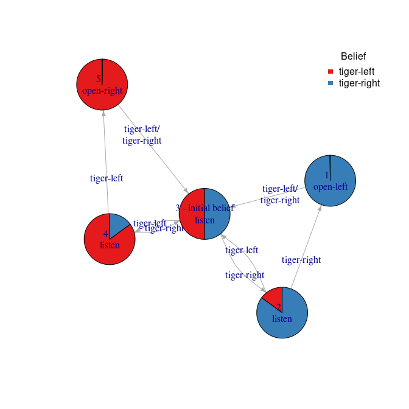

#  R package pomdp - Infrastructure for Partially Observable Markov Decision Processes (POMDP)

[](https://CRAN.R-project.org/package=pomdp)
[](https://mhahsler.r-universe.dev/pomdp)
[](https://CRAN.R-project.org/package=pomdp)

## Introduction

A partially observable Markov decision process (POMDP) models an agent
decision process where the agent cannot directly observe the
environment’s state, but has to rely on observations. The goal is to
find an optimal policy to guide the agent’s actions.

The `pomdp` package provides the infrastructure to define and analyze
the solutions of optimal control problems formulated as Partially
Observable Markov Decision Processes (POMDP). The package uses the
solvers from [pomdp-solve](http://www.pomdp.org/code/) (Cassandra, 2015)
available in the companion R package
[**pomdpSolve**](https://github.com/mhahsler/pomdpSolve) to solve POMDPs
using a variety of exact and approximate algorithms.

The package provides fast functions (using C++, sparse matrix
representation, and parallelization with `foreach`) to perform
experiments (sample from the belief space, simulate trajectories, belief
update, calculate the regret of a policy). The package also interfaces
to the following algorithms:

- Exact value iteration
  - **Enumeration algorithm** (Sondik 1971; Monahan 1982).
  - **Two pass algorithm** (Sondik 1971).
  - **Witness algorithm** (Littman, Cassandra, and Kaelbling 1995).
  - **Incremental pruning algorithm** (Zhang and Liu 1996; Cassandra,
    Littman, and Zhang 1997).
- Approximate value iteration
  - **Finite grid algorithm** (Cassandra 2015), a variation of
    point-based value iteration to solve larger POMDPs (**PBVI**; see
    (Pineau, Gordon, and Thrun 2003) without dynamic belief set
    expansion.
  - **SARSOP** (Pineau, Gordon, and Thrun 2003), point-based algorithm
    that approximates optimally reachable belief spaces for
    infinite-horizon problems (via package
    [sarsop](https://github.com/boettiger-lab/sarsop)).

If you are new to POMDPs then start with the [POMDP
Tutorial](https://pomdp.org/tutorial/).

To cite package ‘pomdp’ in publications use:

> Hahsler M (2023). *pomdp: Infrastructure for Partially Observable
> Markov Decision Processes (POMDP)*. R package version 1.1.0-1,
> <https://github.com/mhahsler/pomdp>.

    @Manual{,
      title = {pomdp: Infrastructure for Partially Observable Markov Decision Processes (POMDP)},
      author = {Michael Hahsler},
      year = {2023},
      note = {R package version 1.1.0-1},
      url = {https://github.com/mhahsler/pomdp},
    }

## Installation

**Stable CRAN version:** Install from within R with

``` r
install.packages("pomdp")
```

**Current development version:** Install from
[r-universe.](https://mhahsler.r-universe.dev/pomdp)

``` r
install.packages("pomdp", repos = "https://mhahsler.r-universe.dev")
```

## Usage

Solving the simple infinite-horizon Tiger problem.

``` r
library("pomdp")
data("Tiger")
Tiger
```

    ## POMDP, list - Tiger Problem
    ##   Discount factor: 0.75
    ##   Horizon: Inf epochs
    ##   Size: 2 states / 3 actions / 2 obs.
    ## 
    ##   List components: 'name', 'discount', 'horizon', 'states', 'actions',
    ##     'observations', 'transition_prob', 'observation_prob', 'reward',
    ##     'start', 'terminal_values'

``` r
sol <- solve_POMDP(model = Tiger)
sol
```

    ## POMDP, list - Tiger Problem
    ##   Discount factor: 0.75
    ##   Horizon: Inf epochs
    ##   Size: 2 states / 3 actions / 2 obs.
    ## 
    ##   Solved:
    ##     Method: grid
    ##     Solution converged: TRUE
    ##     # of alpha vectors: 5
    ##     Total expected reward: 1.933439
    ## 
    ##   List components: 'name', 'discount', 'horizon', 'states', 'actions',
    ##     'observations', 'transition_prob', 'observation_prob', 'reward',
    ##     'start', 'solution'

Display the value function.

``` r
plot_value_function(sol, ylim = c(0, 20))
```

<!-- -->

Display the policy graph.

``` r
plot_policy_graph(sol)
```

<!-- -->

## Acknowledgments

Development of this package was supported in part by National Institute
of Standards and Technology (NIST) under grant number
[60NANB17D180](https://www.nist.gov/ctl/pscr/safe-net-integrated-connected-vehicle-computing-platform).

## References

<div id="refs" class="references csl-bib-body hanging-indent">

<div id="ref-Cassandra2015" class="csl-entry">

Cassandra, Anthony R. 2015. “The POMDP Page.” <https://www.pomdp.org>.

</div>

<div id="ref-Cassandra1997" class="csl-entry">

Cassandra, Anthony R., Michael L. Littman, and Nevin Lianwen Zhang.
1997. “Incremental Pruning: A Simple, Fast, Exact Method for Partially
Observable Markov Decision Processes.” In *UAI’97: Proceedings of the
Thirteenth Conference on Uncertainty in Artificial Intelligence*,
54--61.

</div>

<div id="ref-Littman1995" class="csl-entry">

Littman, Michael L., Anthony R. Cassandra, and Leslie Pack Kaelbling.
1995. “Learning Policies for Partially Observable Environments: Scaling
Up.” In *Proceedings of the Twelfth International Conference on
International Conference on Machine Learning*, 362–70. ICML’95. San
Francisco, CA, USA: Morgan Kaufmann Publishers Inc.

</div>

<div id="ref-Monahan1982" class="csl-entry">

Monahan, G. E. 1982. “A Survey of Partially Observable Markov Decision
Processes: Theory, Models, and Algorithms.” *Management Science* 28 (1):
1–16.

</div>

<div id="ref-Pineau2003" class="csl-entry">

Pineau, Joelle, Geoff Gordon, and Sebastian Thrun. 2003. “Point-Based
Value Iteration: An Anytime Algorithm for POMDPs.” In *Proceedings of
the 18th International Joint Conference on Artificial Intelligence*,
1025–30. IJCAI’03. San Francisco, CA, USA: Morgan Kaufmann Publishers
Inc.

</div>

<div id="ref-Sondik1971" class="csl-entry">

Sondik, E. J. 1971. “The Optimal Control of Partially Observable Markov
Decision Processes.” PhD thesis, Stanford, California.

</div>

<div id="ref-Zhang1996" class="csl-entry">

Zhang, Nevin L., and Wenju Liu. 1996. “Planning in Stochastic Domains:
Problem Characteristics and Approximation.” HKUST-CS96-31. Hong Kong
University.

</div>

</div>
